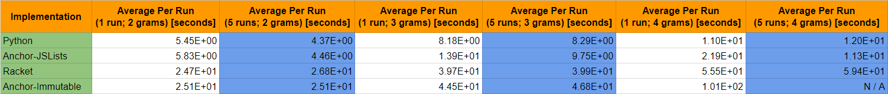

# Purpose

The purpose of this repo is to compare the dictionary runtimes different implementations by generating a year to N-gram counter of text extracted from text files.

# Implementation

All implementations follow a similar procedure when generating the N-gram counter:

* all text files in the `data/` directory are collected and accounted, where their year is specified by the last four characters in the file name
* each year in the dictionary maps to another dictionary that maps n-grams of size 1, 2, and 3 to the total count of occurrences across all files

There are a total of 5 different implementations that we will be looking at:

* [`anchor-immutable`](anchor-immutable.arr) - experimental CLI implementation of Pyret that utilizes Facebook's immutable collection's lists and maps
* [`anchor-jslists`](anchor-jslists.arr) - similar to `anchor-immutable`, but the underlying structure is JavaScript's arrays and objects
* [`python`](python.py) - Python implementation that utilizes its builtin lists and dictionaries
* [`pyret`](pyret.arr) - Pyret-of-today implementation that utilizes its builtin lists and string dictionaries
* [`racket`](racket.rkt) - Racket implementation that utilizes its builtin lists and dictionaries

In order to determine the performance of each implementation, this repo aims to measure the average time it takes to generate the complete N-gram counter for 115 files accounting for up to tri-grams. Further assertion checks are made after the generation of these N-gram counters in order to determine if they were correctly constructed.

# Data



# Discussion

### Pyret's List Limitations

The data for the `pyret` implementation was not considered above as it was unable to build a database without resulting in an error. While Pyret is compiled into a JavaScript file, the error results in a call stack overflow when attempting to read the length of a large list, in this case the list containing all the words in a text file. In order to overcome this, it is possible to override the maximum size of memory that Pyret provides to JavaScript to execute.

### Anchor's Memory Allocation

While attempting to measure the runtime for creating 5 4-gram counter databases, `anchor-immutable` failed to allocate enough memory for its dictionary, as the maximum heap memory size was reached and the garbage collector was not able to compact for the necessary space, therefore resulting in an `N/A` in the table above. While this did not prevent Anchor from generating at least one correct database, we cannot be sure of its runtime to be an accurate depiction for `anchor-immutable`'s performance. Furthermore, since the garbage collector was unable to compact enough space, it must mean that memory is being occupied by some dictionaries that were not marked for deletion. However, looking at the immutable module's JavaScript implementation, no dictionaries are being saved as they are all created locally.

### Racket's `dict-set!` and `dict-update!`

One significant note to make is the difference in performance in using `dict-set!` or `dict-update!` when incrementing the count of all grams per file. When a key, say the bigram "and then", was encountered in the text of a file, there are two possible courses of action:

1. Update the value mapped to this key by incrementing its counter by 1

2. Insert the key and map it to the value of `1` since there have been no previous encounters of this key before

The following is a possible implementation of the logic explained above:

```
( cond
  [( hash-has-key? tree key ) ( dict-set! tree key ( + ( dict-ref tree key ) 1 ) )]
  [else ( dict-set! tree key 1 )] )
```

Another possible implementation would take Racket's `dict-update!` function into account,

```
( dict-update! tree key ( lambda ( counter ) ( + counter 1 ) ) 0 )
```

This implementation retrieves the value mapped to the key in the tree and assigns it to the value returned by the specified function. If the key had never been defined in the map, the last value (`0` in this case) is given as default. This however, did not perform well overall. While the average runtime per N-gram counter database took around `39.9` seconds with the first implementation, using `dict-update!` increased the runtime to around `172` seconds per database, nearly 5 times slower. Considering that Racket may be taking time to allocate the lambda functions prior to calling `dict-update!`, a third implementation was made, such that the lambda function would be defined once as a named function,

```
( define ( update-counter count )
  ( + count 1 ) )
...
( dict-update! tree key update-counter 0 ) 
```

However, this did not cause much effect on the runtime, still taking around `174` seconds to create the database. The cause of this slowdown would require an investigation to how `dict-update!` retrieves and stores mapped values.

# Conclusion